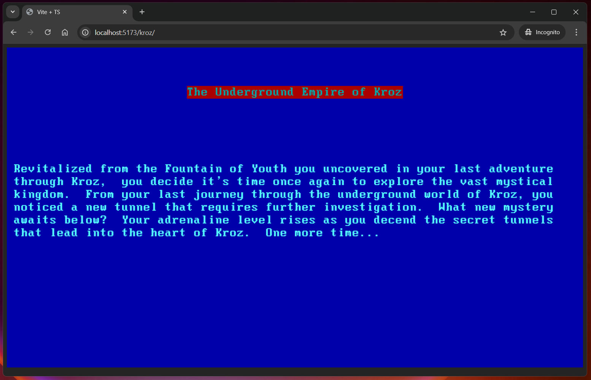
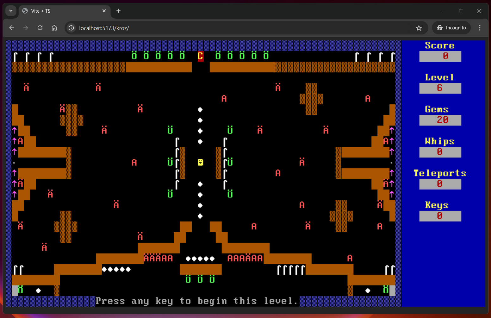

# Return to the Lost Adventures of KROZ

## Introduction

This is a text adventure game that is a tribute to the original KROZ series of games. The original KROZ games were created by Scott Miller and published by Apogee Software. The original KROZ games were released in the late 1980s and early 1990s. This is an unofficial rewrite/remix of the original KROZ games in JavaScript (TypeScript).

The goal is mimic the original KROZ games, while proving a framework for new features and improvements. This version of KROZ is written in JavaScript (TypeScript) and uses the ROT.js library for the game engine using the [original KROZ source code](https://github.com/tangentforks/kroz) as a reference.

## How to Play

The game is played in the browser. You can play the game by visiting the following URL: https://hypercubed.github.io/kroz/

## Screenshots

### Title Screen

### Game Screen

## Q&A

**Q: Is this an KROZ emulator?**

*A*: No. This is a rewrite of the original KROZ games in JavaScript (TypeScript). The original KROZ games were written in PASCAL.

**Q: Why does X not work like the original KROZ?**

*A*: This is a work in progress. The goal is to mimic the original KROZ games closely, but there may be differences.  Timing will be particularly hard to get right.

**Q: Can I contribute to this project?**

*A*: Yes! Please feel free to fork this project and submit a pull request.  I would love to have help with this project.

**Q: Can I add a level?**

*A*: Sure! The levels are defined in the `levels.ts` file.  You can add a new level by adding a new object to the `levels` array.

## License

The original "Kroz" copyright 1987 - 2022 Apogee Entertainment Inc. All trademarks and copyrights reserved.  This project is a tribute to the original KROZ games and is not affiliated with Apogee Entertainment Inc. in any way.

This project is licensed under the MIT License. See the LICENSE file for details.

